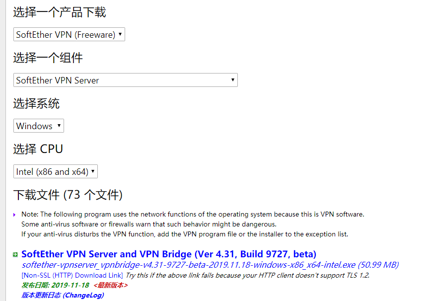
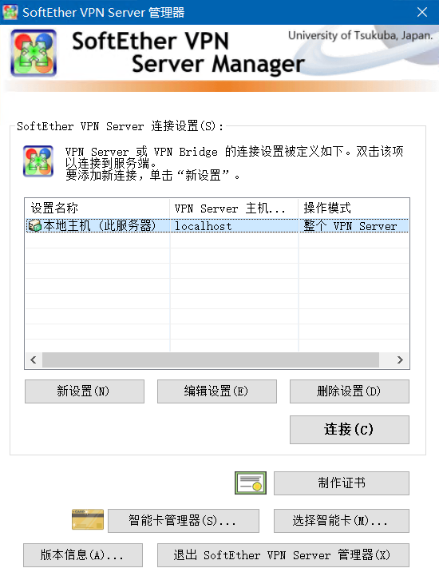
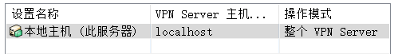
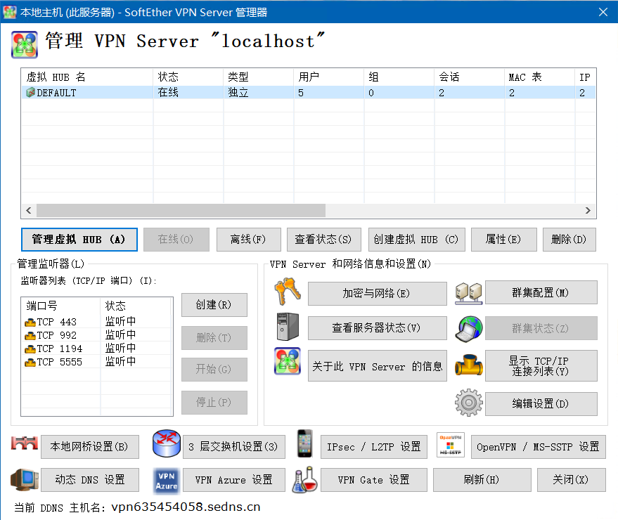
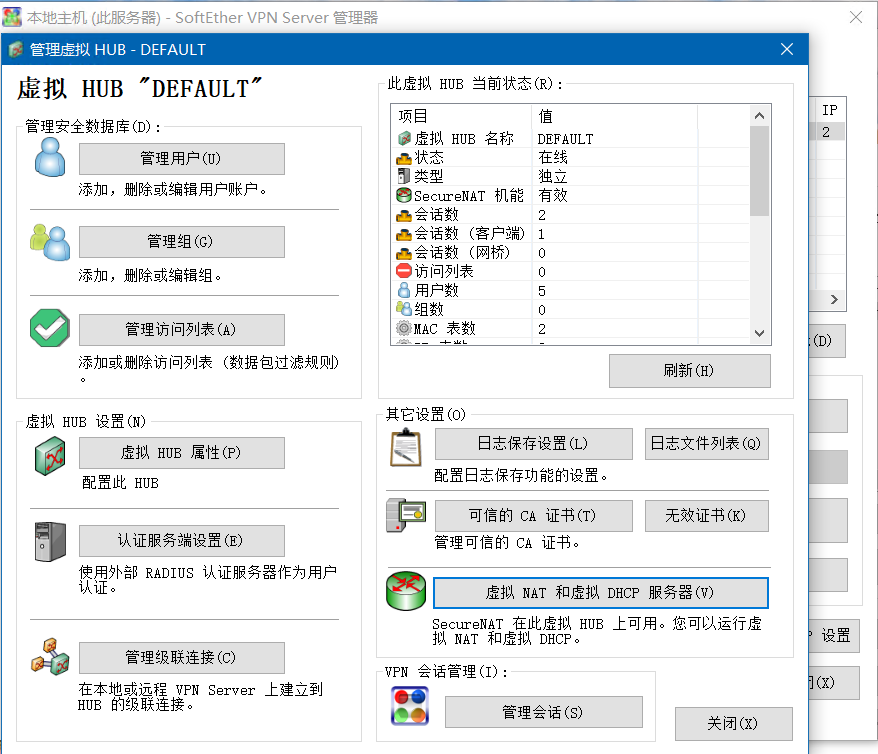
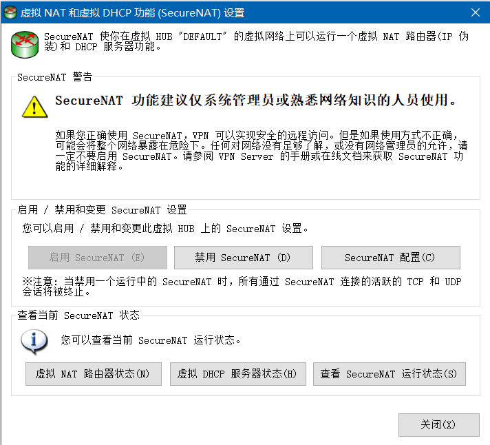
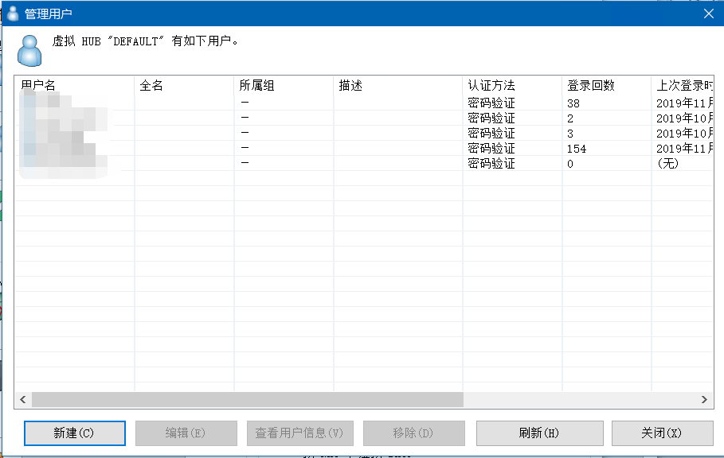
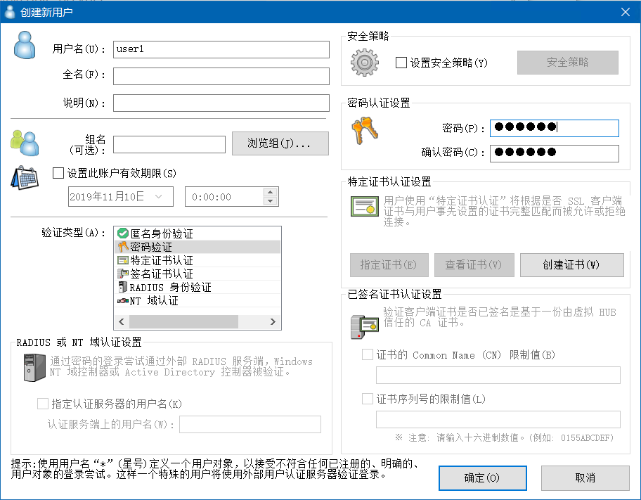
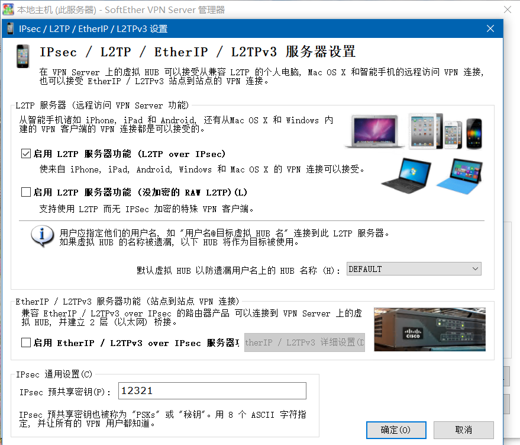
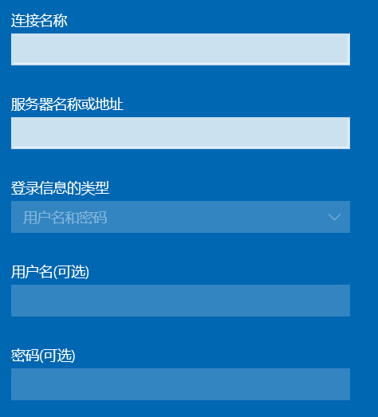

---
slug: campus-netbypass
title: 如何绕过校园网验证，在宿舍免费上办公区的网，享受不拥挤的网络
authors: cxOrz
tags: [tech]
---

**如何绕过校园网验证，在宿舍免费用办公区的网**

## 前言

> 上了大学后发现上网成了难题，流量太贵买不起，流量卡又限速而且电脑上网也不方便，想办校园单宽，可是那网络体验根本配不上付的钱，除非去校园营业厅办移动或者联通的卡开通校园网套餐，可，我，不愿向垄断的运营商和学校低头！

既然办公区网速比宿舍区快，能上网，那就利用办公区电脑，在宿舍就可以连了！

<!--truncate-->

**需求**：一台办公区的电脑

## 利用Softether改造办公区电脑

在办公区的电脑上下载Softether[点击下载](https://www.softether-download.com/cn.aspx?product=softether)，选择适合你的版本，在这里我选择如下的版本：

下载完成后安装，安装时选择**SoftEther *** Server**，这里我们是把电脑当作服务器的，所以要安装服务器端的软件部分。

## 配置

安装完成后打开：

双击**本地主机**这一行：

会让你设置一个管理密码，设置完之后就可以开始配置了。

**端口号**要选择**5555**

下图为开始配置界面：

点击**管理虚拟HUB**，进入此界面：

启用**虚拟NAT和虚拟DHCP服务器**：

关闭，然后可以点击**管理用户**，**新建**，添加账号密码等

回到最开始的界面，点击**IPsec/L2TP设置**：

**启用L2TP功能**，并设置**预共享密钥**，随便设置一个就行。

完成！

## 使用方法

在手机或者其他想上网的电脑上新建VPN连接，

然后连上就可以了，记得要**先连上校园网WiFi或者接上网线**，不用登录校园网账号了，直接“连接到工作区域”。
只要在办公区那台电脑上连上网并且可以正常上网，其他设备连上它就可以正常使用，就可以在**宿舍连上办公区**的网了。

配置连接时，**服务器地址**填刚刚配置Softether的那台电脑的IP，可以在那台电脑上用cmd命令ipconfig得到。

终于，可以愉快地上网了。开森~
