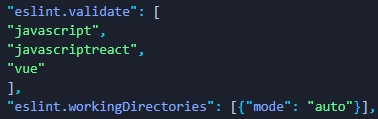

---
slug: eslint-plugin-vue-failed
title: Failed to load plugin ‘vue‘...Cannot find module ‘eslint-plugin-vue‘解决方案
authors: cxOrz
tags: [vue]
---

> Failed to load plugin 'vue' declared in 'proj\.eslintrc.js': Cannot find module 'eslint-plugin-vue'

VSCode使用Vue时ESLint无法使用，参考以下步骤。

<!--truncate-->

## 错误信息

```bash
[Info  - 下午5:50:02] ESLint server is starting
[Info  - 下午5:50:02] ESLint server running in node v12.14.1
[Info  - 下午5:50:02] ESLint server is running.
[Info  - 下午5:50:03] ESLint library loaded from: C:\Users\cxOrz\Documents\Vue\vueproj\node_modules\eslint\lib\api.js
[Error - 下午5:53:14] 
Failed to load plugin 'vue' declared in 'vueproj\.eslintrc.json': Cannot find module 'eslint-plugin-vue'
Require stack:
- C:\Users\cxOrz\Documents\Vue\__placeholder__.js
Referenced from: C:\Users\cxOrz\Documents\Vue\vueproj\.eslintrc.json
Happened while validating C:\Users\cxOrz\Documents\Vue\vueproj\src\components\TransCompo.vue
This can happen for a couple of reasons:
1. The plugin name is spelled incorrectly in an ESLint configuration file (e.g. .eslintrc).
2. If ESLint is installed globally, then make sure 'eslint-plugin-vue' is installed globally as well.
3. If ESLint is installed locally, then 'eslint-plugin-vue' isn't installed correctly.

Consider running eslint --debug C:\Users\cxOrz\Documents\Vue\vueproj\src\components\TransCompo.vue from a terminal to obtain a trace about the configuration files used.

```
尝试以下步骤：

 1. 检查eslint的配置文件是否创建了，例如.eslintrc.json，如果没有创建，按下<kbd>ctrl</kbd>+<kbd>shift</kbd>+<kbd>p</kbd>然后输入 `Create ESLint configuration`，回车确认创建配置文件（前提是全局安装的，否则请按照第2、3步在控制台使用**命令行**进行初始化）。
 2. 如果ESLint是全局安装的，则请确保你正确地全局安装了'eslint-plugin-vue'，不放心可以再执行一遍 `npm install -g eslint-plugin-vue`，如果没有创建.eslintrc配置文件就在控制台运行`eslint --init`
 3. 如果ESLint安装在本地，检查本地的'eslint-plugin-vue'是否正确安装，不放心也可以再执行`npm install eslint-plugin-vue`，如果没有创建eslintrc配置文件就在控制台运行`.\node_modules\.bin\eslint --init`(具体路径按照自己的来)。
 4. 如果确保以上步骤都正确执行了，没有问题，就去Setting(JSON)里，查看是否添加eslint对vue文件检查？是否设置了eslint的工作文件夹？

  

  工作文件夹的设置可以按照图中的自动模式，这样eslint会自动根据package.json等文件来判断工作文件夹。也可以自己输入文件夹，来设定，比如设定当前项目文件夹vueproj为工作文件夹：`"eslint.workingDirectories": ["vueproj"]`。

现在再看看代码是不是有错误提示了？重启VSCode呢？还没有就去Google一下吧。

## Tips

如果使用了vetur插件，想使用ESLint插件的提示而不是vetur自带的 (其实就是上述步骤的目的) ，别忘了在setting中添加`"vetur.validation.template": false`，这样就不使用vetur自带的eslint了。
