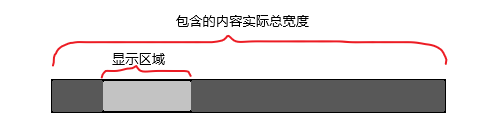
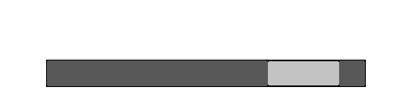
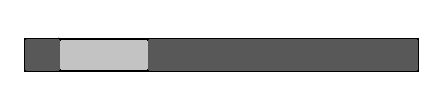

---
slug: vue3-gsap-carousel
title: Vue3+gsap 实现轮播组件
authors: cxOrz
tags: [vue]
---

我们要用到gsap的ScrollToPlugin插件实现滚动的动画效果,样式用Tailwind写了一部分、手撸了一部分。

**效果如图**


<!--truncate-->

## 安装配置

npm安装gsap

```shell
npm install gsap
```
项目中配置gsap
```javascript
import { gsap } from 'gsap'// 导入gsap到vue项目
import { ScrollToPlugin } from 'gsap/ScrollToPlugin'// 导入gsap插件ScrollToPlugin
gsap.registerPlugin(ScrollToPlugin)// 注册插件
//配置完成,可以使用
```
## 部分代码
抽了一部分核心代码，供参考
```html
<template>
  <div class="w-11/12 m-auto py-10">
    <div class="text-left pb-10">
      <span class="block">欢庆永远不嫌早</span>
      <h1 class="text-4xl font-bold">推荐的音乐视频</h1>
    </div>
    <button
      v-if="scrollbar.scrollleft"
      @click="scrollleft"
      id="btn-left"
      class="absolute -left-5 bottom-44 w-10 h-10 shadow-2xl focus:outline-none rounded-full bg-white"
    ></button>
    <div
      id="VmusicCarousel"
      ref="carousel"
      class="carousel space-x-7 overflow-x-auto whitespace-nowrap"
    >
   <!-- 此处VmusicCarousel包裹一堆轮播内容 -->
   ...
    </div>
    <button
      v-if="scrollbar.scrollright"
      @click="scrollright"
      id="btn-right"
      class="absolute -right-5 bottom-44 w-10 h-10 shadow-2xl focus:outline-none rounded-full bg-white"
    ></button>
  </div>
</template>
```

```javascript
<script>
import { reactive, ref } from 'vue'
import { gsap } from 'gsap'
import { ScrollToPlugin } from 'gsap/ScrollToPlugin'
gsap.registerPlugin(ScrollToPlugin)
export default {
  name: 'VmusicCarousel',
  setup () {
    const carousel = ref(null)
    const scrollbar = reactive({
      value: 0,
      scrollleft: false,
      scrollright: true
 })

    function scrollright () {
      if (!scrollbar.scrollleft) {
        scrollbar.value = 0
        scrollbar.scrollleft = true
      }// 最左边时执行
      if (carousel.value.scrollWidth - scrollbar.value <= 2 * carousel.value.offsetWidth) {
        gsap.to(carousel.value, { duration: 0.7, scrollTo: { x: carousel.value.scrollWidth - carousel.value.offsetWidth }, ease: 'power2.inOut' })
        scrollbar.scrollright = false
        return
      }
      scrollbar.value += carousel.value.offsetWidth
      gsap.to(carousel.value, { duration: 0.7, scrollTo: { x: scrollbar.value }, ease: 'power2.inOut' })
    }

    function scrollleft () {
      if (!scrollbar.scrollright) {
        scrollbar.scrollright = true
      }// 最右边时执行
      if (scrollbar.value <= carousel.value.offsetWidth) {
        gsap.to(carousel.value, { duration: 0.7, scrollTo: { x: 0 }, ease: 'power2.inOut' })
        scrollbar.scrollleft = false
        return
      }
      scrollbar.value -= carousel.value.offsetWidth
      gsap.to(carousel.value, { duration: 0.7, scrollTo: { x: scrollbar.value }, ease: 'power2.inOut' })
    }
    return { scrollright, scrollleft, scrollbar }
  }
}
</script>
```

```css
<style lang="scss" scoped>
span {
  font-size: 1.1rem;
  color: #ffffff80;
}
#btn-right {
  background-image: url('../assets/images/right.svg');
  background-size: 1.5rem;
  background-repeat: no-repeat;
  background-position: center;
}
#btn-left {
  background-image: url('../assets/images/left.svg');
  background-size: 1.5rem;
  background-repeat: no-repeat;
  background-position: center;
}
.carousel::-webkit-scrollbar {
  display: none;
}
</style>

```

## 轮播滚动逻辑详解
>即函数scrollright和scrollleft



图中“显示区域”在代码中为一个 ref 对象 `carousel` 。carousel.value`即为它对应的DOM节点。

`carousel.value.offsetWidth`在网页中是我们可见的包裹着全部轮播内容的“框”,图中是浅色部分。

`carousel.value.scrollWidth`在网页中是它内容的实际宽度，图中是深色+浅色部分。

代码中定义的`scrollbar`对象，其中`value`用来储存当前滚动到的位置（即为浅色部分左边与深色部分最左边的距离），scrollleft用来储存是否显示向左按钮，同理`scrollright`作用于向右按钮。

我们通过控制当前滚动到的位置，来实现轮播内容显示到不同区域。
&nbsp;
&nbsp;
有几种情况，我们分类讨论：
&nbsp;
### 向右滚动

**正常情况下**
我们每次向右滚动一段距离，距离为`显示区域`的宽度。每次滚动前更新当前处于位置的值。
`scrollbar.value += carousel.value.offsetWidth`
然后滚动到该位置
`gsap.to(carousel.value, { duration: 0.7, scrollTo: { x: scrollbar.value }, ease: 'power2.inOut' })`

**当右边深色部分{'<='}显示区域宽度时**



向右滚动距离应为`carousel.value.scrollWidth - carousel.value.offsetWidth`，即右边深色部分的宽度。
使用`gsap.to`进行滚动
`gsap.to(carousel.value, { duration: 0.7, scrollTo: { x: carousel.value.scrollWidth - carousel.value.offsetWidth }, ease: 'power2.inOut' })`
此时隐藏向右按钮
&nbsp;
&nbsp;
### 向左滚动

**正常情况下**
我们每次向左滚动一段距离，距离为`显示区域`的宽度。每次滚动前更新当前处于位置的值。
`scrollbar.value -= carousel.value.offsetWidth`
然后滚动到该位置
`gsap.to(carousel.value, { duration: 0.7, scrollTo: { x: scrollbar.value }, ease: 'power2.inOut' })`

**当左边深色部分{'<='}显示区域宽度时**



直接滚动到0处，
`gsap.to(carousel.value, { duration: 0.7, scrollTo: { x: 0 }, ease: 'power2.inOut' })`
然后隐藏向左按钮
`scrollbar.scrollleft = false`

## 最后
这是正在写的音乐网站项目中的一个模块，完整项目...过些日子写完了后续会附在下方 :)
