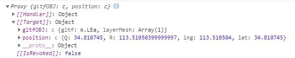
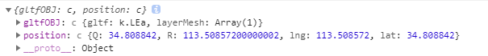

---
slug: vue-toraw
title: vue获取proxy对象中的原始对象
authors: cxOrz
tags: [vue]
---

在使用vuex时，由于state是响应式的，用它获取对象值输出也是proxy对象。例如：



无论是Vuex还是使用的Composition API 的`reactive()`，vue中的响应式对象可使用`toRaw()`方法获取原始对象。

```javascript
// 导入toRaw函数
import { toRaw } from '@vue/reactivity'
// 该函数返回转换后的对象
const crystal = toRaw(store.state.mapping.crystal)
// 输出可以看到已经不是proxy对象了
console.log(crystal[0])
```


