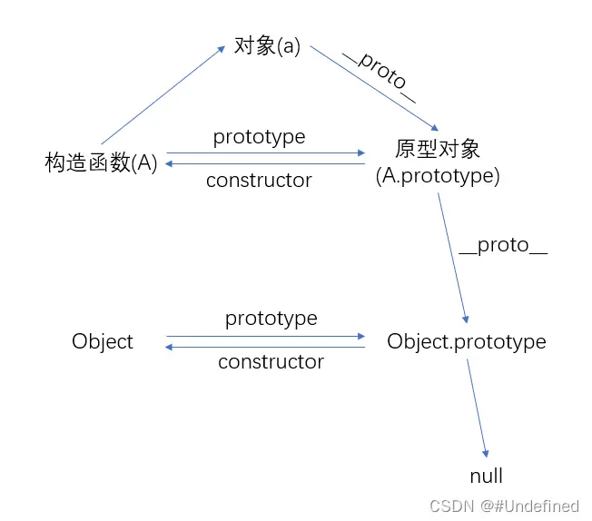

---
slug: js-constructor-prototype
title: JavaScript 原型和原型链以及constructor属性
authors: cxOrz
tags: [js]
---

## Prototype 原型对象
Prototype 翻译过来叫“原型”，原型是一种在开发生命周期的早期显示应用程序或产品的外观和行为的模型。Javascript 中的 **prototype** 叫原型对象，**是每一个函数都有的属性**。

<!--truncate-->

在控制台中打印 Array.prototype，得到下面的输出。发现它的 prototype 里有我们数组对象所有的函数，可以推知在使用构造函数创建了对象之后，对象会“引用”构造函数的prototype，从而自身可以访问这些函数。实际上，当使用一个对象来访问一个函数时，如果这个对象没有定义该函数，则会沿着原型链，一层一层的向上找，找对象的proto（简称一下），然后找对象proto的proto，然后找对象的proto的proto的proto，直到找到该函数并执行或者到原型链最顶层了也没有找到（报出undefined错误）。


```
at: ƒ at()
concat: ƒ concat()
constructor: ƒ Array()
copyWithin: ƒ copyWithin()
entries: ƒ entries()
every: ƒ every()
fill: ƒ fill()
filter: ƒ filter()
find: ƒ find()
// ... 省略
[[Prototype]]: Object
```

```javascript
function A(){} // 定义一个函数 A
```
在 Javascript 中函数也是对象，可以自行验证 `A instanceof Object` 或者 `Array instanceof Object` 或者 `String instanceof Object` 得到的结果都是 `true`。直观地看一下，打印 `typeof A.prototype`，获得以下结果。

```
'object'
```

## 原型链
函数：存在 prototype 属性，其中 prototype 属性里又有一个 constructor 属性。constructor 指向该函数本身。
对象：存在 \_\_proto\_\_ 属性，它指向它的构造函数的 prototype 。（一个函数，用它 new 出了对象，这个函数就叫构造函数）

结合一个例子，来说明清楚。
```javascript
function A() {
  this.text = 'I am A.'
}
const a = new A();

console.log(a.__proto__ === A.prototype); // true
console.log(a.__proto__.__proto__ === Object.prototype); // true
console.log(Object.prototype.__proto__); // null
console.log(a.__proto__.__proto__.__proto__); // null
```
a 是函数 A 构造出来的对象， a.__proto\_\_ 指向它的构造函数的原型对象 A.prototype， A.prototype.__proto\_\_ 指向它的原型对象 Object.prototype，Object.prototype.\_\_proto\_\_ 指向 null。
下面这段话摘自MDN文档：

> 每个实例对象都有一个私有属性（称之为 \_\_proto__ ）指向它的构造函数的原型对象（prototype）。该原型对象也有一个自己的原型对象（\_\_proto__），层层向上直到一个对象的原型对象为 null。根据定义，null 没有原型，并作为这个原型链中的最后一个环节。

为了更清楚的看到原型对象和原型链到底是啥样子的，在控制台打印 A.prototype 和 Object.prototype，输出如下：

```js
A.prototype
{
  constructor: f A()
  [[Prototype]]: Object
}
```
```js
Object.prototype
{
  constructor: f Object()
  hasOwnProperty: f hasOwnProperty()
  isPrototypeOf: f isPrototypeOf()
  toString(): f toString()
  valueOf(): f valueOf()
  // ...
}
```

`[[Prototype]]` 只是在控制台里这样显示，实际上**它是就是 `__proto__`**。可以得知，A.prototype.__proto\_\_ 指向了 Object.prototype，也就是 a.__proto\_\_.__proto\_\_ 指向 Object.prototype。一个原型对象指向上层的一个原型对象，上层的原型对象一个又指向上上层的一直指到最后为 null 的链，就是原型链。

## constructor 属性
constructor 是 prototype 的属性，constructor 指向构造函数本身。
```javascript
A.prototype.constructor === A // true
('some text').constructor === String // true
([1,2]).constructor === Array // true
```
依照前面的例子，如图可以清晰的看到整个原型链。


