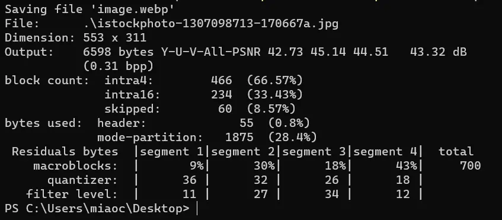

WebP 是谷歌推出的一种可以同时提供有损压缩和透明度的图片格式，但是与 JPEG 或 PNG 相比，它格式可以提供更好的压缩。

如图，我将一个 54KB 的JPG图片，转换成 WebP 格式的图片，最终图片大小仅为 8KB ，压缩了7倍左右，看上去很夸张。确实夸张，这个是因图片而异的，有些图片可以压缩很多有些则压不了这么多，不过这种图片格式确实是比 JPEG 和 PNG 有不少优势，压缩率确实高。

在网络上，各类资源文件中，图片仍然是占用流量较大的一部分，浏览的各个网站无论是新闻、营销或是企业官网，都有很多的图片，各大视频网站也都要展示视频的缩略图，看上去几十 KB 的压缩给人带来的体验似乎没啥区别，但是图片展示量大、使用多的情况，就像 B站 这样的情况，那节省的就不是一点半点的流量了，服务器带宽压力也减小了，企业省钱、用户体验增强，两全其美。