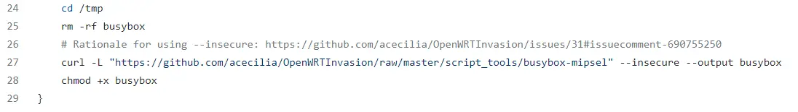
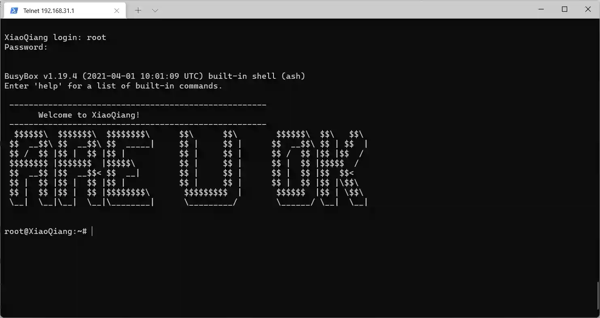
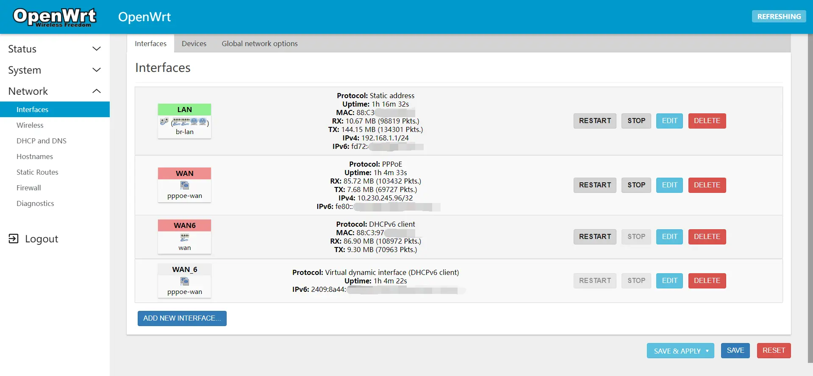

小米路由器4A千兆版 是一款基于联发科 MT7621 SoC 的室内无线路由器，具有三个以太网端口（2xLAN + 1xWAN）、双频 802.11bgn + AC 无线 WiFi，有两种版本 China/Global 固件。

之前在老电脑上安装了 x86 的 Openwrt，这次给路由器安装一下。

## 获取stok
访问 192.168.31.1，输入密码进入后台首页，将看到网址中有一个参数 `stok=xxxxxx`，复制 stock 参数，后续会用的到。

## 克隆项目
该项目可利用远程命令执行漏洞开启路由器的 telnet、ftp 和 ssh 服务：
```bash
git clone https://github.com/acecilia/OpenWRTInvasion
```

进入项目目录后，安装依赖：
```bash
pip3 install -r requirements.txt
```
## 修改脚本
依赖安装后，需要修改一下 `script.sh` 文件，脚本中有 **两处** curl 下载命令，执行过程中绝大多数情况下会下载失败，所以先下载下来，再利用 http-server 类似的工具开启一个本地服务器，使得那两个文件可以在局域网设备间都能访问。再用局域网内它们对应的下载地址替换原来 GitHub 上的地址，保存。



## 连接路由器
运行下列命令，中途需要输入 stok 和 路由器管理地址：
```bash
python3 remote_command_execution_vulnerability.py
```

若执行成功，执行以下命令连接路由器，并输入用户名(root) 和 密码(root)。如果没有启用 telnet ，去 `启用或关闭Windows功能` 里开启一下。
```bash
telnet 192.168.31.1
```


## 刷入固件
telnet 连接到路由器后，另开一个终端，把[下载好的固件](https://downloads.openwrt.org/releases/21.02.1/targets/ramips/mt7621/openwrt-21.02.1-ramips-mt7621-xiaomi_mi-router-4a-gigabit-squashfs-sysupgrade.bin)用 ftp 传进去。
```
ftp 192.168.31.1
cd /tmp
put ./Downloads/firmware.bin
```
传输完成后关闭。

在 telnet 终端中继续，开始刷入固件：
```bash
cd /tmp
mtd -e OS1 -r write firmware.bin OS1
```

刷入成功将提示路由器重启，连接中断。

访问 192.168.1.1 即可进入 Openwrt 管理页面，默认用户名密码均为 root。

