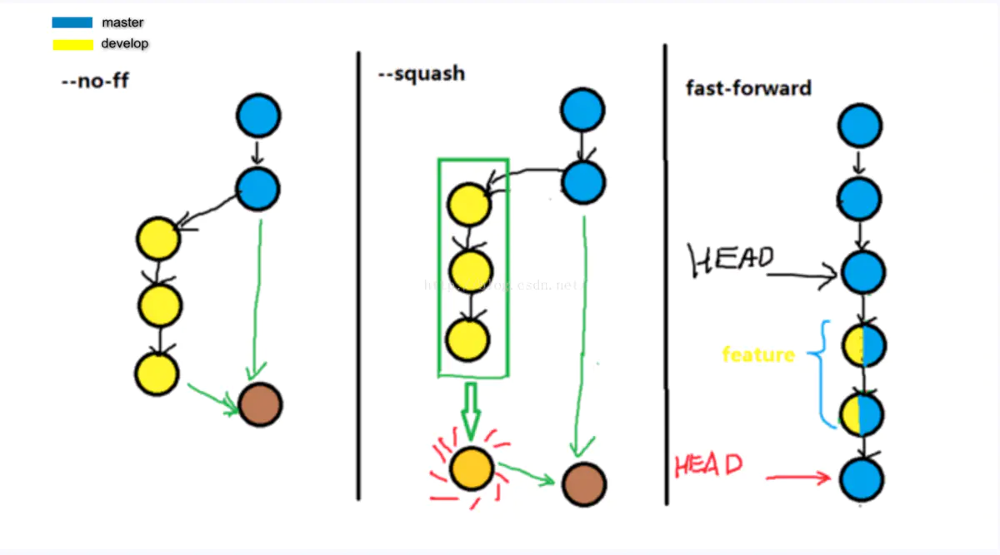

> 一些常用的命令如下，不算全面但是日常对我来说是够用了。

- `git clone url` ：克隆项目，如需自定义本地文件夹的名称，在 url 之后加个名称即可。
- `git add` ：这是个多功能命令，可以用它开始跟踪新文件，或者把已跟踪的发生更改的文件放到暂存区，还能用于合并时把有冲突的文件标记为已解决状态等。
- `git rm` ：要从 Git 中移除某个文件，就必须要从暂存区域移除，然后提交。可以用 `git rm` 完成，并连带从工作目录中删除指定的文件，这样以后就不会出现在未跟踪文件清单中了。
- `git diff` ：查看尚未暂存的文件更新了哪些部分。在后面加一个 `--staged` 参数，将比对已暂存文件与最后一次提交的文件差异。
<!--truncate-->
- `git status` ：查看哪些文件处于什么状态、当前所在分支。
- `git commit -m "msg"` ：提交，`-m` 参数可将提交信息在后面附上。提交时记录的是放在暂存区域的快照。 任何还未暂存文件的仍然保持已修改状态，可以在下次提交时纳入版本管理。
- `git log` ：查看提交历史。
- `git reset` ：撤销操作。
- `git remote` ：查看远程仓库，可使用 `-v` 查看更详细信息。
- `git fetch <remote>` ：从远程仓库拉取数据。

## 一、通过SSH方式使用GitLab
### 创建SSH私钥和公钥
`ssh-keygen -t` 生成密钥，-t 参数后面跟着加密类型
```bash
ssh-keygen -t ed25519
```
生成之后，`.pub` 后缀的文件即是公钥文件，无后缀名的则是私钥文件

### 验证身份
`-T` 参数为 `不显示终端，只显示连接成功信息`
```
ssh -T git@gitlab.com
```
之后就可以使用ssh地址克隆项目了

## 二、更改仓库地址

基本知识：
- `git remote` 查看所有远程仓库，加上 `-v` 则显示详细信息（包括所有仓库的地址）
- `git remote get-url origin` 查看 origin 的远程仓库地址
- `git remote set-url [--push] <name> <newurl> [<oldurl>]`
```bash
git remote set-url origin https://xxxxx.git
```
## 三、撤销操作
### 修补提交
有时候我们提交完了才发现漏掉了几个文件没有添加，或者提交信息写错了。可在修改或添加后，add到暂存区，然后使用 `git commit --amend` 来修正提交。就像下面一样：
```bash
git commit -m 'initial commit'
git add forgotten_file
git commit --amend
```
如果单使用 `--amend` 参数，会打开 vim 然后在里面修改上次的 commit 消息。如果还使用了 `-m` 那就在后面直接写上提交消息，然后提交了。

### 取消暂存的文件
暂存了多余的文件，如何取消呢，使用 `git reset HEAD <file>` 来撤销对该文件的暂存。在 VSCode 中可以通过点击 Unstage Changes 实现，而 Discard Changes 实际上是下面要说的 **恢复到上次提交的样子**。

### 恢复到上次提交的样子
对于已追踪但未暂存的文件，比如你改了一堆代码然后发现不满意，想要回到之前的样子(最后一次提交)，使用 `git checkout -- <file>` 即可。

### 撤销提交
代码提交了但是又后悔了，想要重新编辑一下提交信息，建议使用修补提交的方法，即使用 `--amend` 参数修补提交一下。

当然，也可以使用 `git reset --soft HEAD^` 直接撤销 commit。其中 `HEAD` 是指针，`HEAD^` 和 `HEAD~1` 指向上一次提交，`HEAD^^` 和 `HEAD~2` 指向上上次提交。

reset 的几个参数：
1. 使用参数--mixed(默认参数)，将撤销提交，撤销暂存，保留工作区改动的代码
2. 使用参数--soft，将撤销提交，不撤销暂存，保留工作区改动的代码
3. 使用参数--hard，将撤销提交，撤销暂存，删除工作区改动的代码

## 四、远程仓库使用

### 添加远程仓库
如果一份代码，分布到多个git仓库，就可以添加多个仓库。或多人协作时，方便拉取和推送别人的代码。
```bash
git remote add cxlab https://gitlab.com/cx_x/meoo-space.git
```

### 推送到远程仓库
将本地的一份代码推送到不同的仓库中，例如将本博客的 main 分支推送到 cxlab 服务器。
```bash
git push cxlab main
```

### 拉取更新
`git fetch` + `git merge` = `git pull`；

fetch 命令会访问远程仓库，从中拉取所有你还没有的数据。执行完成后，你将会拥有那个远程仓库中所有分支的**引用**，可以随时合并或查看。它并不会自动合并或修改你当前的工作，必须手动合并代码。

### 远程仓库重命名和删除
将 cxlab 重命名为 gtlab
```bash
git remote rename cxlab gtlab
```

将 gtlab 远程仓库从本地删除
```bash
git remote remove gtlab
```
一旦你使用这种方式删除了一个远程仓库，那么所有和这个远程仓库相关的远程跟踪分支以及配置信息也会一起被删除。

## 五、打标签
> 可以给仓库历史中的某一个提交打上标签，以示重要。 比较有代表性的是人们会使用这个功能来标记发布结点（ v1.0 、 v2.0 等等）。

使用 `git tag` 列出所有标签，按照通配符列出标签需要 -l 或 --list 选项，例如 `git tag -l "v1.8.5*"`。

### 添加标签
在 GitHub 中 release 一个版本的代码或者安装包的时候，就需要创建或者选择一个 tag。
> Git 支持两种标签：轻量标签（lightweight）与附注标签（annotated）。
> 
> 轻量标签很像一个不会改变的分支——它只是某个特定提交的引用。
> 
> 而附注标签是存储在 Git 数据库中的一个完整对象， 它们是可以被校验的，其中包含打标签者的名字、电子邮件地址、日期时间， 此外还有一个标签信息，并且可以使用 GNU Privacy Guard （GPG）签名并验证。 通常会建议创建附注标签，这样你可以拥有以上所有信息。但是如果你只是想用一个临时的标签， 或者因为某些原因不想要保存这些信息，那么也可以用轻量标签。

```bash
git tag v1.4 #轻量标签
git tag -a v1.4 -m "my version 1.4" #附注标签
```
如果想要给以前的某个提交补打标签：
```bash
git log --pretty=oneline #输出所有提交
git tag -a v1.2 9fceb02 #对特定的提交补打一个tag
```

### 推送标签
`git push` 并不会把标签推送到远程仓库服务器上，在创建完标签后必须显式地推送到服务器。可以运行 `git push origin <tagname>`。如果想要一次性推送很多标签，也可以使用 `git push --tags` 命令，将把所有不在远程仓库服务器上的标签全部推送。

### 删除标签

要删除掉你本地仓库上的标签，可以使用命令：
```bash
git tag -d <tagname>
```
同时删除远程分仓库中的该标签：
```bash
git push origin --delete <tagname>
```

## 六、分支操作
`git branch` 命令不只是可以创建与删除分支。如果不加任何参数运行它，会得到当前所有分支的一个列表。

### 创建分支
创建一个 `mybranch` 分支
```bash
git branch mybranch
```

### 切换分支
在切换分支时，一定要注意你工作目录里的文件会被改变。 如果是切换到一个较旧的分支，你的工作目录会恢复到该分支最后一次提交时的样子。

切换到 `mybranch` 分支
```bash
git checkout mybranch
```
创建并切换到 `newbranch` 分支
```bash
git checkout -b newbranch
```

### 合并分支
回到 master 分支，将 hotfix 分支合并进来
```bash
git checkout master
git merge hotfix #默认fast-forward
```
当合并遇到冲突时，可用 `git status` 查看冲突，手动解决冲突后，使用 `git add` 命令来将其标记为冲突已解决。一旦暂存这些原本有冲突的文件，Git 就会将它们标记为冲突已解决。如果对结果感到满意，并且确定之前有冲突的的文件都已经暂存了，这时你可以输入 `git commit` 来完成合并提交。下图为 merge 的三种方式区别。



### 删除分支
当完成一个 hotfix 的合并之后，应该把该分支删除：
```bash
git branch -d hotfix
```

## 七、远程分支
`git fetch cxlab` 可以将远程仓库 cxlab 有而本地没有的数据更新到本地。加上 `--all` 参数可以抓取所有远程仓库的数据。

要特别注意的一点是，本地已有 `cxlab/master` 分支，当抓取到新的远程跟踪分支 `cxlab/serverfix` 时，本地不会自动生成一份可编辑的副本。换一句话说，不会有一个新的 serverfix 分支——只有一个不可以修改的 `cxlab/serverfix` 指针。

可以运行 `git merge cxlab/serverfix` 将这些工作合并到**当前所在的分支**。如果想要在自己的 sf 分支上工作，可以将其建立在远程跟踪分支之上：
```bash
git checkout -b sf cxlab/serverfix
```

### 跟踪分支
从一个远程跟踪分支检出一个本地分支，会自动创建所谓的“跟踪分支”（它跟踪的分支叫做“上游分支”）。跟踪分支是与远程分支有直接关系的本地分支。如果在一个跟踪分支上输入 `git pull`，Git 能自动地识别去哪个服务器上抓取、合并到哪个分支。

设置已有的本地分支跟踪一个刚刚拉取下来的远程分支，或者想要修改正在跟踪的上游分支， 你可以在任意时间使用 `-u` 或 `--set-upstream-to` 选项运行 `git branch` 来显式地设置。
```bash
$ git branch -u origin/serverfix
Branch sf set up to track remote branch serverfix from origin.
```

`git branch -vv` 会将所有的本地分支列出来并且包含更多的信息，如每一个分支正在跟踪哪个远程分支与本地分支是否是领先、落后...

### 推送分支
将 hotfix 分支推送到 cxlab 远程仓库：
```bash
git push cxlab hotfix #如需将推送到服务器上的分支名改为 myhotfix，可这样 hotfix:myhotfix
```

### 删除远程分支
若已经完成了热修复，并且已经合并到主分支，已经用不到 serverfix 分支，则可以从远程仓库删除它：
```bash
git push origin --delete serverfix
```

说的再多都不如看一看文档，实在是细：https://git-scm.com/book/zh/v2