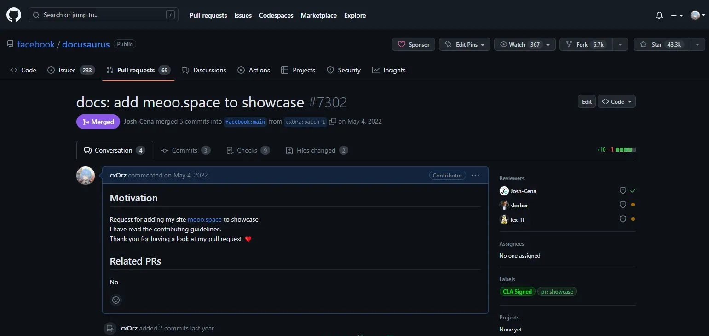
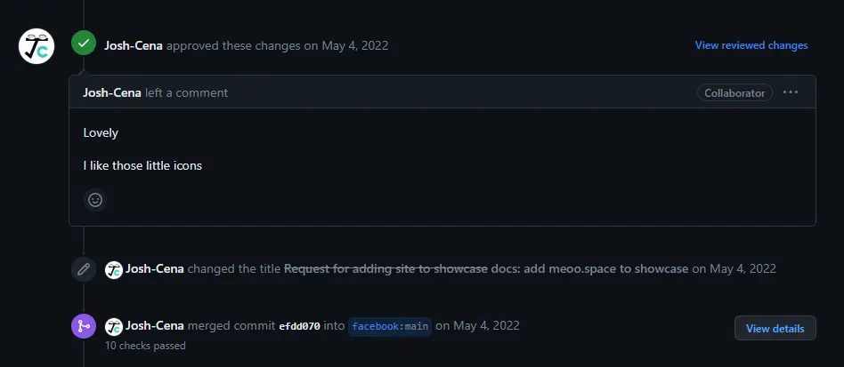

今天逛 GitHub 时看到了 docusaurus 的仓库，临时起意打算把自己的网站也提交到 showcase 里，没想到居然不一会就被合并了。

上一次提交 `pull request` 还是在上次...
<!-- truncate -->

不开玩笑了，正经的说其实上次提交 pr 是三年前 (大一的时候) 。那时在学习 GitHub 的使用，忘了在哪个教程看到了个给 bootstrap 提交 pr 的范例，我就学着也去提交一个。我还专门去 issue 里找需求，找到一个需要 “清扫” 图标的提议，类似这种🧹。然后在 Adobe Illustrator 画一个扫把清理垃圾的图标，提交上去并且附注 “solved issue xxxx” 里当时傻，以为提交了没什么问题就能过。实际上就提交一个图标谁看啊，贡献微不足道，搁置了好久好久，最后被关闭了。

今天，没想到这么轻松就被合并了。当时预感到有希望，就仔细看了看贡献要求，去找了好多个合并成功的例子，看他们的预览图片大小、PR说明、提交的内容，或许是准备做的不错，避开了一些其他人踩到的坑才这么顺利的。

最后感觉自己提交的图片不太完美，正在重新截图一张裁剪一下提交上去，结果还没来得及提交就被合并了😂。今天体验到了前所未有的快乐，感谢 Facebook，感谢 Josh, 感谢我自己！

下次 docusaurus 网站更新，应该就能看到俺滴网站了嘿嘿~