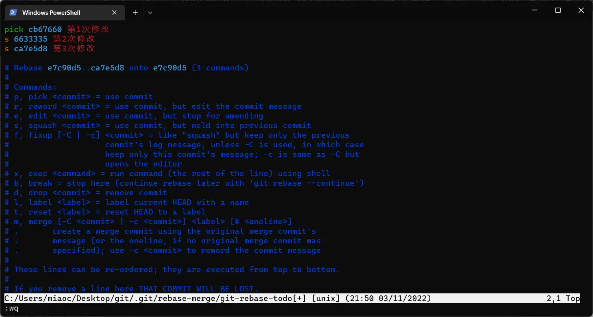

Git Rebase 自己压根没用过，正巧公司团队要用到，学习总结一下。

## 使用场景

合并提交：完成一个 feature 提交了很多次，有很多杂乱连续的 commit，团队对提交规范要求一个特性对应一次提交，此时需要合并多个提交为一个。

分支变基：多人协作开发时，用 merge 合并分支会多出一个 `Merge Commit` 的提交，这个提交是两个分支的最新节点的合并项。分支树呈现的是一条线从 main 分支叉出去，经过几个提交，又汇合到 main，汇合处形成了一个提交节点。团队想要让提交记录是线性的，也不想要这个多余的提交，此时适合进行变基。

### 举例
有一个提交结点树，C1是首次提交，C4是 hotfix 分支第一次提交。主线是 main 分支。
```
               C4 <- C5
              /
C1 <- C2 <- C3 <- C6
```
<!-- truncate -->
#### Merge
C7：自动生成的新提交，由 C5 和 C6 合并 (Merge branch xxx of xxx)。提交树不是线性，会按提交时间顺序显示记录。
```
               C4 <- C5
              /        \
C1 <- C2 <- C3 <- C6 <- C7
```

#### Rebase
C4 和 C5 的 CommitID 会改变，在此标记为 C4' 和 C5'。提交树变成了线性的，并不会按提交时间顺序排列，而是直接将 hotfix 分支的提交续在 main 分支后。
```
C1 <- C2 <- C3 <- C6 <- C4' <- C5'
```

## 合并提交

现有下面的提交记录，想要把三次提交合并成一次。

```
commit ca7e5d8de0c5509064433ae4f0a5624300d18fcc (HEAD -> master)
Author: cxOrz <miaochenxi@outlook.com>
Date:   Thu Nov 3 21:49:31 2022 +0800

    第3次修改

commit 663333512b0a8355d27e1660b8a40797d580f298
Author: cxOrz <miaochenxi@outlook.com>
Date:   Thu Nov 3 21:49:19 2022 +0800

    第2次修改

commit cb676606c7beb3a5cd095d0d44bef3cc38e54ff1
Author: cxOrz <miaochenxi@outlook.com>
Date:   Thu Nov 3 21:49:07 2022 +0800

    第1次修改

commit e7c90d556101e1f02bee7f27fa7e1a87614c28ab
Author: cxOrz <miaochenxi@outlook.com>
Date:   Thu Nov 3 21:48:41 2022 +0800

    Initial commit
```

从 `e7c90d5` 开始，对在它之后的提交进行变基（合并），将会改变历史。
```bash
# git rebase -i  [startpoint]  [endpoint] 接受一个区间，默认从 startpoint 到底
git rebase -i e7c90d5
```
根据提示，做出修改，将第2、3次提交向前合并。修改完后，将跳到填写提交信息界面，可将三段提交信息删除，填上一句总的提交信息。



完成后，记录如下：
```
commit 03cdd2e7d24ee4dec017455c84c687ac9239772e (HEAD -> master)
Author: cxOrz <miaochenxi@outlook.com>
Date:   Thu Nov 3 21:49:07 2022 +0800

    合并提交

commit e7c90d556101e1f02bee7f27fa7e1a87614c28ab
Author: cxOrz <miaochenxi@outlook.com>
Date:   Thu Nov 3 21:48:41 2022 +0800

    Initial commit
```

## 分支变基

现在按照场景举例的内容往下说，通过 rebase 来合并分支时，一般有以下流程：

一、切换到要变基的分支，也就是 hotfix 分支。运行以下命令：
```bash
git checkout hotfix
git rebase main
```
此时，hotfix 分支的基，变到了 main 上。

二、如果有冲突，需要解决冲突，解决后运行：
```bash
git add .
```
跟踪变动的文件。

三、冲突解决完，继续完成 rebase 操作
```bash
git rebase --continue
```

四、切换到主分支，合并变过基的 hotfix 分支
```bash
git checkout main
git merge hotfix
```
到这里，就完成了所有的操作，但是这些变化都是本地的，如果需要更新到远程仓库，要推送一下。

五、推送主分支到远程仓库
```bash
git push
```

通过 rebase 来合并分支，hotfix 上的提交就被续在了 main 分支之后，得到一条线性提交树。