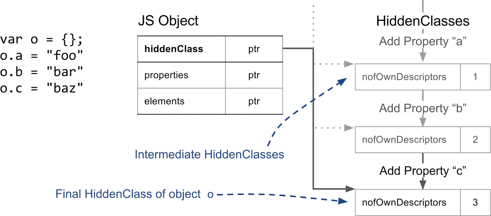
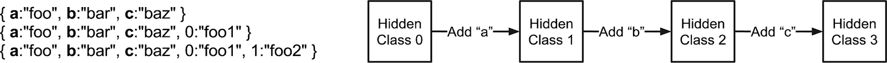
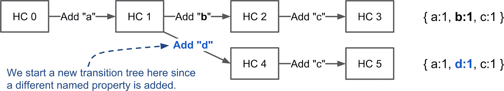
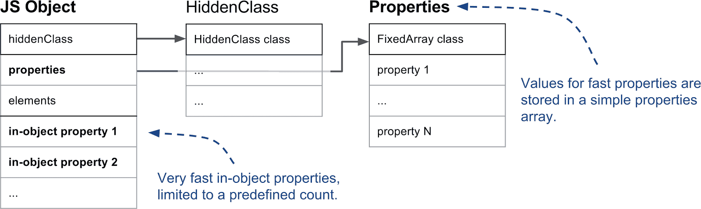
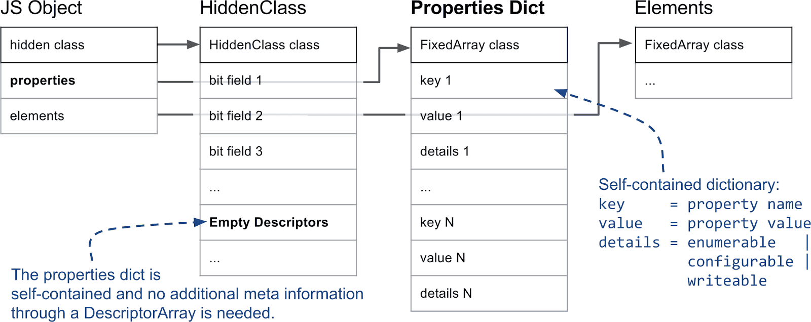
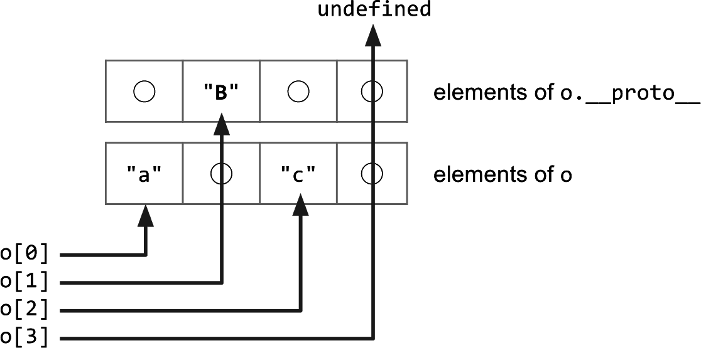

:::info
本文翻译、修改自 [Fast properties in V8](https://v8.dev/blog/fast-properties)，其中会删除、修改、批注部分内容，但确保不改变原本的意思，使阅读更加通顺。
:::

在本篇内容中，我们将介绍 V8 内部是如何处理 JavaScript 属性的。从 JS 的角度来看，对象（Object）和 字典（Dictionary）差不多：以字符串为键，任意对象为值。不过，在进行迭代时，会对整数索引的属性和其他属性进行不同处理。其他情况下，不同属性的行为基本相同，与是否整数索引无关。

不过，出于性能和内存方面的考虑，V8 确实依赖于几种不同的属性表示方式。在本篇文章中，我们将解释 V8 如何在处理动态添加的属性时提供快速的属性访问。同时，了解属性的工作原理对于解释 V8 是如何做优化的，例如[内联缓存](http://mrale.ph/blog/2012/06/03/explaining-js-vms-in-js-inline-caches.html)，也是至关重要的。

本文将先阐述处理整数索引属性和命名属性的区别，然后，我们将展示 V8 在添加命名属性时，如何维护 HiddenClasses 以便提供一种快速识别对象形状的方法。然后，我们将继续深入介绍命名属性如何根据使用情况进行优化，以实现快速访问或快速修改。最后，我们将详细介绍 V8 如何处理整数索引属性或数组索引。

<!-- truncate -->

## Named Properties 和 Elements
让我们先分析一个非常简单的对象，如 `{a："foo"，b: "bar"}`。这个对象有两个命名属性：`a` 和 `b`，没有任何整数索引的属性。数组索引的属性通常被称为元素，例如数组 `["foo", "bar"]` 有两个数组索引属性：`0` 的值为 `"foo"`，`1` 的值为 `"bar"`，通常这就是 V8 处理属性的第一个主要区别。

下图显示了一个简单的 JS 对象在内存中的样子：


元素和属性存储在两个独立的数据结构中，这使得添加和访问属性或元素的效率更高（用各自高效的方式分别处理他们俩）。

元素主要用于 Array.prototype 的各种方法，如 pop 或 slice，鉴于这些函数是访问连续范围内的属性，V8 在内部也将它们表示为简单数组，大多情况下都是这样。在文章后面，我们将解释有些时候是如何切换到基于稀疏字典的形式以节省内存的。

:::info 如何理解上面这段话？
在JS中，一切皆是对象，那么数组也是对象，一个 `['a', 'b', 'c']` 数组，其实长这样： `{1: 'a', 2: 'b', 3:'c'}`。slice 方法会返回由一段元素组成的数组，会访问连续的一段属性，比如 slice 复制了第 2 到 10 个元素然后组成一个数组返回，在 V8 在内部把它们表示为数组（而不是表示成字符串索引的字典），会高效很多。
:::

命名属性以类似的方式存储在一个单独的数组中。与元素不同的是，我们不能简单地使用键来推断它们在属性数组中的位置；我们需要一些额外的元数据。在 V8 中，每个 JavaScript 对象都有一个相关的隐藏类（HiddenClass），它存储了关于对象形状的信息，以及从属性名称到属性索引的映射。~~为了使事情复杂化~~，我们有时会使用字典，而不是简单的数组，将在专门章节中对此进行详细说明。

**本节的启示：**

- 数组索引属性存储在**元素存储区**中。
- 命名属性存储在**属性存储区**中。
- **元素**和**属性**既可以是数组，也可以是字典。
- 每个 JavaScript 对象都有一个相关的隐藏类（HiddenClass），用于保存有关对象形状的信息。

:::note
数组索引属性：`['a','b']`、`{1: 'a', 2: 'b'}`  
命名属性：`{'first': 'a', 'second': 'b'}`、`{name: 'Lee', age: 18}`  
:::

## HiddenClasses 和 DescriptorArrays

在解释了元素和命名属性的一般区别后，我们需要看看 HiddenClasses 在 V8 中是如何工作的。隐藏类（HiddenClass）存储了对象的**元信息**，包括对象的属性数量和对象原型的引用。HiddenClasses 在概念上类似于面向对象编程语言中的类。但是，在 JavaScript 等基于原型的语言中，通常无法预先知道类。因此，在本例 V8 中，HiddenClasses 是即时创建的，并随着对象的变化而动态更新。HiddenClasses 作为象形状的标识符，是 V8 优化编译器和内联缓存的重要组成部分。如果优化编译器可以通过 HiddenClass 确保兼容的对象结构，那么它就可以直接内联属性的访问。

HiddenClass 的重要部分如下图所示：


在 V8 中，JavaScript 对象的第一个字段就指向隐藏类（HiddenClass），事实上，任何在 V8 Heap 里并由垃圾回收器管理的对象都是如此。就属性而言，最重要的信息是第三个比特字段，其中存储了属性的数量，以及指向描述符数组（DescriptorArrays）的指针。描述符数组包含命名属性的信息，如名称本身和值储存的位置。请注意，我们不追踪整数索引属性，因此描述符数组中没有对应的内容。

HiddenClasses 的基本假设是，具有相同结构的对象（例如，具有相同的命名属性且顺序也相同）共享相同的 HiddenClass。为了实现它，在向对象添加属性时将使用一个不同的 HiddenClass。在下面的示例中，我们向一个空对象添加三个命名属性。



每添加一个新属性，对象的 HiddenClass 就会变化。V8 会在后台创建一个过渡树，将 HiddenClasses 链接在一起。例如，当你为一个空对象添加属性 "a "时，V8 知道应该使用哪个 HiddenClass。如果以相同的顺序添加相同的属性，过渡树将确保最终的 HiddenClass 相同。下面的示例表明，即使我们添加了简单的索引属性，也遵循相同的过渡树。



但是，如果我们创建了一个新对象，并添加了不同的属性，在本例中是属性 "d"，V8 就会为新的 HiddenClasses 另外创建一个分支。



**本节的启示：**

- 具有相同结构（相同顺序的相同属性）的对象共享相同的 HiddenClass。
- 默认情况下，每添加一个新的命名属性，就会创建一个新的 HiddenClass。
- 添加数组索引属性不会创建新的 HiddenClasses。

## 三种不同的命名属性

在概述了 V8 如何使用隐藏类（HiddenClasses）来跟踪对象的形状之后，让我们深入了解一下这些属性的实际存储方式。正如上文介绍的那样，属性有两种基本类型：命名属性和索引属性。下面将介绍命名属性。

在 V8 内部，简单的对象（如 {a：1, b：2}）可以有多种不同的表示形式。虽然 JS 对象看起来与字典差不多，但 V8 内部会尽量避免使用字典，因为它会妨碍某些优化（例如内联缓存）。

对象内属性vs普通属性：V8 支持直接存储在对象本身的属性，也就是所谓的对象内属性，这些属性是 V8 中速度最快的属性，因为它们无需任何间接操作即可访问。对象内属性的数量由对象的初始大小决定，如果添加的属性多于对象中的空间大小，它们就会被存到属性储存区中。属性储存区使得访问属性多了一层间接操作，但可以使其独立增长。



快属性vs慢属性：通常，我们将线性储存的属性定义为快属性。快属性只需通过索引就能访问，要利用属性名在属性存储区中找到对应的实际位置，必须查阅 HiddenClass 上的描述符数组，这一点在前面已经提到过。



然而，如果一个对象要添加和删除很多属性，就会消耗大量时间和内存来维护描述符数组（Descriptor Array）和 隐藏类（HiddenClasses）。因此，V8 支持所谓的慢属性，具有慢属性的对象自身包含一个字典作为属性存储区。所有属性元信息不再存到 HiddenClass 的描述符数组中，而是直接存到自身的字典中，因此，添加和删除属性都无需更新 HiddenClass。但内联缓存不适用于字典属性，通常它比快属性更慢。

**本节的启示：**

- 有三种不同的命名属性类型：**对象内属性**、**快属性**和**慢属性（字典属性）**。
- 对象内属性直接存储在对象本身，访问速度最快。
- 快属性在属性储存区，所有元信息都存储在 HiddenClass 上的描述符数组中。
- 慢属性保存在自身的属性字典里，元信息不再通过 HiddenClass 共享。
- 慢属性可以高效地删除和添加属性，但访问速度比其他两种类型慢。

## 元素还是数组索引属性

到目前为止，我们已经了解了命名属性，忽略了数组中常用的整数索引属性。处理整数索引属性的复杂程度并不亚于命名属性。尽管所有索引属性总是单独保存在元素存储区中，但是有 20 种不同类型的元素！

满的（Packed）或有空隙的（Holey）元素：V8 做出的第一个区别是，元素的存储是包装的还是有空隙的。如果删除了一个索引元素，或者没有定义索引元素，就会在存储中出现空隙。一个简单的例子是 `[1,,3]`，其中第二个元素就是一个空隙。下面的示例说明了这个问题：

```js
const o = ['a', 'b', 'c'];
console.log(o[1]);          // Prints 'b'.

delete o[1];                // Introduces a hole in the elements store.
console.log(o[1]);          // Prints 'undefined'; property 1 does not exist.
o.__proto__ = {1: 'B'};     // Define property 1 on the prototype.

console.log(o[0]);          // Prints 'a'.
console.log(o[1]);          // Prints 'B'.
console.log(o[2]);          // Prints 'c'.
console.log(o[3]);          // Prints undefined
```



简而言之，如果对象上不存在某个属性，就必须继续在原型链上寻找。由于元素是自包含的，我们不会在 HiddenClass 上存储关于当前索引属性的信息，因此我们需要一个名为 `the_hole` 的特殊值来标记不存在的属性，这对数组函数的性能至关重要。如果我们知道没有空隙，即元素存储区是满的，我们就可以执行本地操作，而无需在原型链上进行昂贵的查找。

快或字典元素：元素的第二个主要区别是它们是快模式还是字典模式。快元素就是简单的虚拟机内部数组，其属性索引映射到元素存储区的索引。然而，这种简单的表示法对于只有很少条目被占用的大型稀疏/空隙型数组来说是相当浪费的。在这种情况下，我们使用基于字典的表示法来节省内存，但代价是访问速度稍慢：

```js
const sparseArray = [];
sparseArray[9999] = 'foo'; // Creates an array with dictionary elements.
```

在本示例中，分配一个长度为 10000 的数组将非常浪费。相反，V8 会创建一个字典，用于存储 **键-值-描述符** 三元组。本例中的键将会是 `"9999"`，值是 `"foo"`，使用的是默认描述符。由于我们没有办法在 HiddenClass 上存储描述符详细信息，因此使用自定义描述符定义索引属性时，V8 都会采用慢元素：

```js
const array = [];
Object.defineProperty(array, 0, {value: 'fixed' configurable: false});
console.log(array[0]);      // Prints 'fixed'.
array[0] = 'other value';   // Cannot override index 0.
console.log(array[0]);      // Still prints 'fixed'.
```

在本例中，我们在数组上添加了一个不可配置的属性，该信息存储在慢元素字典三元组的描述符部分。需要注意的是，数组函数在慢元素对象上运行时速度会大大降低。

## 参考
- [Fast properties in V8](https://v8.dev/blog/fast-properties)