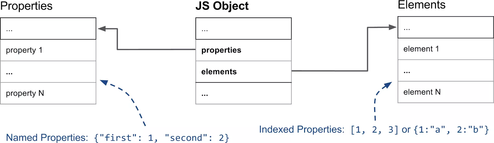
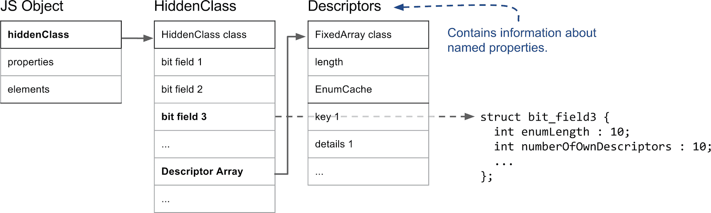

:::info
本文翻译、修改自 [Fast properties in V8](https://v8.dev/blog/fast-properties)，其中会删除、修改、批注部分内容，但确保不改变原本的意思，使阅读更加通顺。
:::

在本篇内容中，我们将介绍 V8 内部是如何处理 JavaScript 属性的。从 JS 的角度来看，对象（Object）和 字典（Dictionary）差不多：以字符串为键，任意对象为值。不过，在进行迭代时，会对整数索引的属性和其他属性进行不同处理。其他情况下，不同属性的行为基本相同，与是否整数索引无关。

不过，出于性能和内存方面的考虑，V8 确实依赖于几种不同的属性表示方式。在本篇文章中，我们将解释 V8 如何在处理动态添加的属性时提供快速的属性访问。同时，了解属性的工作原理对于解释 V8 是如何做优化的，例如[内联缓存](http://mrale.ph/blog/2012/06/03/explaining-js-vms-in-js-inline-caches.html)，也是至关重要的。

本文将先阐述处理整数索引属性和命名属性的区别，然后，我们将展示 V8 在添加命名属性时，如何维护 HiddenClasses 以便提供一种快速识别对象形状的方法。然后，我们将继续深入介绍命名属性如何根据使用情况进行优化，以实现快速访问或快速修改。最后，我们将详细介绍 V8 如何处理整数索引属性或数组索引。

## Named Properties 和 Elements
让我们先分析一个非常简单的对象，如 `{a："foo"，b: "bar"}`。这个对象有两个命名属性：`a` 和 `b`，没有任何整数索引的属性。数组索引的属性通常被称为元素，例如数组 `["foo", "bar"]` 有两个数组索引属性：`0` 的值为 `"foo"`，`1` 的值为 `"bar"`，通常这就是 V8 处理属性的第一个主要区别。

下图显示了一个简单的 JS 对象在内存中的样子：

元素和属性存储在两个独立的数据结构中，这使得添加和访问属性或元素的效率更高（用各自高效的方式分别处理他们俩）。

元素主要用于 Array.prototype 的各种方法，如 pop 或 slice，鉴于这些函数是访问连续范围内的属性，V8 在内部也将它们表示为简单数组，大多情况下都是这样。在文章后面，我们将解释有些时候是如何切换到基于稀疏字典的形式以节省内存的。

:::info 如何理解上面这段话？
在JS中，一切皆是对象，那么数组也是对象，一个 `['a', 'b', 'c']` 数组，其实长这样： `{1: 'a', 2: 'b', 3:'c'}`。slice 方法会返回由一段元素组成的数组，会访问连续的一段属性，比如 slice 复制了第 2 到 10 个元素然后组成一个数组返回，在 V8 在内部把它们表示为数组（而不是表示成字符串索引的字典），会高效很多。
:::

命名属性以类似的方式存储在一个单独的数组中。与元素不同的是，我们不能简单地使用键来推断它们在属性数组中的位置；我们需要一些额外的元数据。在 V8 中，每个 JavaScript 对象都有一个相关的隐藏类（HiddenClass），它存储了关于对象形状的信息，以及从属性名称到属性索引的映射。~~为了使事情复杂化~~，我们有时会使用字典，而不是简单的数组，将在专门章节中对此进行详细说明。

本节的启示

- 数组索引属性存储在**元素存储区**中。
- 命名属性存储在**属性存储区**中。
- **元素**和**属性**既可以是数组，也可以是字典。
- 每个 JavaScript 对象都有一个相关的隐藏类（HiddenClass），用于保存有关对象形状的信息。

:::note
数组索引属性：`['a','b']`、`{1: 'a', 2: 'b'}`  
命名属性：`{'first': 'a', 'second': 'b'}`、`{name: 'Lee', age: 18}`  
:::

## HiddenClasses 和 DescriptorArrays

在解释了元素和命名属性的一般区别后，我们需要看看 HiddenClasses 在 V8 中是如何工作的。隐藏类（HiddenClass）存储了对象的**元信息**，包括对象的属性数量和对象原型的引用。HiddenClasses 在概念上类似于面向对象编程语言中的类。但是，在 JavaScript 等基于原型的语言中，通常无法预先知道类。因此，在本例 V8 中，HiddenClasses 是即时创建的，并随着对象的变化而动态更新。HiddenClasses 作为象形状的标识符，是 V8 优化编译器和内联缓存的重要组成部分。如果优化编译器可以通过 HiddenClass 确保兼容的对象结构，那么它就可以直接内联属性的访问。

HiddenClass 的重要部分如下图所示：

在 V8 中，JavaScript 对象的第一个字段就指向隐藏类（HiddenClass），事实上，任何在 V8 Heap 里并由垃圾回收器管理的对象都是如此。就属性而言，最重要的信息是第三个比特字段，其中存储了属性的数量，以及指向描述符数组（DescriptorArrays）的指针。描述符数组包含命名属性的信息，如名称本身和值储存的位置。请注意，我们不追踪整数索引属性，因此描述符数组中没有对应的描述。

## 参考
- [Fast properties in V8](https://v8.dev/blog/fast-properties)