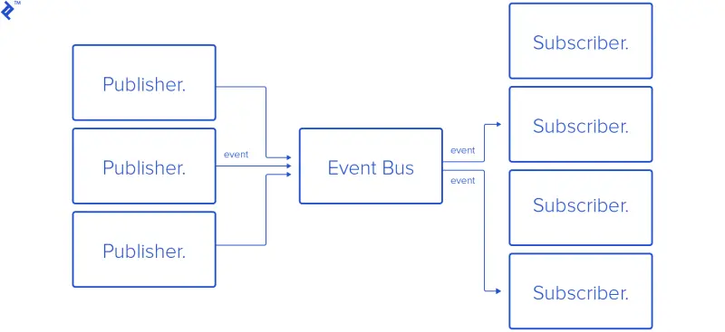

与观察者模式类似，但发布者和观察者不直接沟通，而是通过一个发布订阅中心，通过 event 消息来间接沟通。

发布订阅中心接收来自发布者的消息，然后通知订阅了该消息的订阅者们。



比喻一下，有个报亭，小A来注册了“来报”事件，她希望来报时打电话告诉他来报了。小B也到报亭注册了“来报”事件，他希望来报时发短信告诉他来报了。订阅、退订和通知，这三件事都是发布订阅中心来做。

根据上述比喻，写的示例代码：

```ts
interface IPubSub {
  subscribe(event: string, fn: any): void;
  unSubscribe(event: string, fn: any): void;
  publish(event: string, data: any): void;
}

// 订阅发布中心
class PubSub implements IPubSub {
  private subs: any = {};

  // 注册事件和对应处理函数
  subscribe(event: string, fn: any): void {
    if (this.subs[event]) {
      this.subs[event].push(fn);
    } else {
      this.subs[event] = [fn];
    }
  }

  unSubscribe(event: string, fn: any): void {
    this.subs[event] = this.subs[event].filter((sub: any) => {
      sub !== fn;
    });
  }

  // 发布者发布消息
  publish(event: string, data: any): void {
    for (const fn of this.subs[event]) {
      fn(data);
    }
  }
}

const pubcenter = new PubSub();

// 注册 data 事件，事件触发时，打电话告诉 A 报纸到了
pubcenter.subscribe('data', (data: string) => {
  console.log('Calling Person A: Your newspaper arrives.');
});
// 也为 B 注册 data 事件，事件触发时，发短信告诉它报纸到了
pubcenter.subscribe('data', (data: string) => {
  console.log('Texting Person B: Your newspaper arrives.');
});

pubcenter.publish('data', 'Daaaaaaaaaata.');
```

输出：
```
Calling Person A: Your newspaper arrives.
Texting Person B: Your newspaper arrives.
```