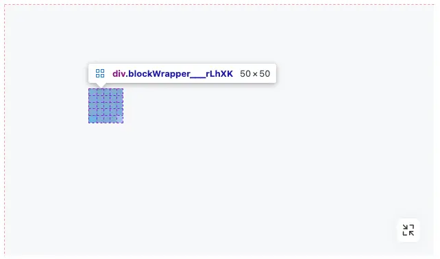
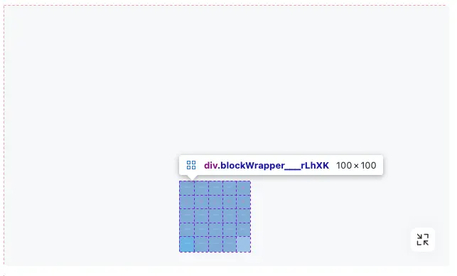

在开发过程中遇到一个情况，使用的绝对定位，同时用 zoom 属性缩小元素，然后计算 left 和 top 偏移量，使得改变大小后中心位置不变。发现在增加 left 和 top 时，反而元素位置离左上角更近了。

zoom 怎么会影响定位呢？结论在末尾！

## 缩放到 0.1 时

此时元素实际宽高均为 50px，而距离容器左边和上边距离容器左边和上边明显不够 1234px，仅仅是他宽高的 2 倍多一点（约123.4px）。
可见 left 和 top 也被等比例缩放了。

```js
position: absolute;
width: 500px;
height: 500px;
zoom: 0.1; // 缩放到0.1
left: 1234px;
top: 1234px;
```


{/* truncate */}

## 缩放到 0.2 时

可以看到元素实际宽高均为 100px，距离容器左边和上边明显不够 1234px，实际仅仅是他宽高的 2 倍多一点（约246.8px）。
可见 left 和 top 也被等比例缩放了。

```js
position: absolute;
width: 500px;
height: 500px;
zoom: 0.2; // 缩放到0.2
left: 1234px;
top: 1234px;
```


## 如何理解

MDN中有这样一段话：

> The zoom CSS property scales the targeted element, which can affect the page layout. When scaling, the zoomed element scales from top and center when using the default writing-mode.

意为：元素默认会以**顶部**和**水平中心**为原点，进行缩放。

如果这样还难理解，那么再加上几个字就一目了然了：the parent container's.

改为：

> The zoom CSS property scales the targeted element, which can affect the page layout. When scaling, the zoomed element <u>scales from the parent container's</u> top and center when using the default writing-mode.

元素会以**所在容器**的**顶部**和**水平中心**为原点，进行缩放。那么一切都说得通了。