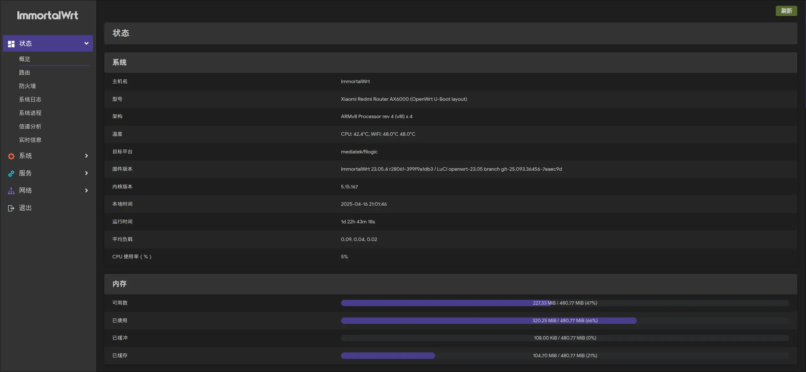

## 前言

去年搬完家就淘汰了 Xiaomi 4A 千兆版 + R2S 这套配置，斥巨资换成了 Redmi AX6000 供日常使用。到现在用了将近 1 年，在此回顾一下和它相关的折腾记录，以便日后参考。

## 固件

在纠结了很多版本（Lean \ Openwrt官方 \ 237 \ hanwckf）之后，还是选择了 ImmortalWrt，吸引我原因的就是支持在线自定义构建，而且项目开源。



<!-- truncate -->

大概步骤：

1. 参照 [Openwrt 官方 Wiki](https://openwrt.org/toh/xiaomi/redmi_ax6000)，刷上 U-Boot 版固件。
2. 来到 [ImmortalWrt Firmware Selector](https://firmware-selector.immortalwrt.org/) 选择 `Xiaomi Redmi Router AX6000 (OpenWrt U-Boot layout)`，选 23.05.4 版本，不需要追新。
3. 在自定义构建的软件包列表里加上 `luci-app-passwall luci-app-smartdns luci-theme-argon`，闪存小所以在构建时添加进去。否则进系统了再下载安装，容易空间不足。
4. 构建，并下载 Sysupgrade 镜像，传到路由器 `/tmp` 目录下，通过 `sysupgrade` 命令安装。

## Passwall

折腾了无数次，它本身自己的流量分流是不错的。但我想用 SmartDNS 对域名解析也分流，让国内域名走一组国内服务器，海外域名通过代理走 Cloudflare 的 DOH。怎么折腾都有问题。

最终还是让他自己接管 DNS 吧，满意了吧。

其他运行问题：

- 分流不起作用，无法上网。看日志、结合 issue，发现默认的分流规则有问题，和 geosite 里的对不上，移除 `geosite:apple-intelligence` 后正常。后续更新组件，需要注意分流规则变动。
- 路由器重启后无法上网，访问网页出现 Privacy Policy 的错误，让 passwall 自己接管 DNS 解析即可。
- 大版本升级，最好重置、重新配置。

有帮助之处：

- AIGC 分流，解决当前地区无法访问 OpenAI、Anthropic、Gemini 等服务的问题。
- 添加自定义分流规则，解决访问 linux.do、影视网站被拦截、流媒体解锁等问题。

## AdGuard Home

前期用过这个插件，可以拦截页面广告、视频广告、隐私收集请求等。但是后来觉得把这个拦截放在路由器有些浪费资源，电脑、手机性能高的很，直接在客户端装插件拦截更高效。

还是让路由器把性能发挥在更需要的地方，比较好。

## dnsmasq

默认提供的 DNS 缓存、主机名映射等功能已经够用了。

最近发现了一个冷门用法，能解决访问海外站点 IPv6 泄露的问题。在访问 Hyprland Wiki 的时候，总被它的 Cloudflare 拦截，怎么改分流都没用。下滑发现，它记录我访问的 IP 每次都是一样的 IPv6 地址，这还得了？怪不得怎么改都没用，IPv6 没经过代理，就直接通过它访问了。

可以在 `/etc/dnsmasq.conf` 中设置规则：
```bash
# 把 hyprland 域名的 IPv6 地址强制解析为空
address=/hyprland.org/::
address=/wiki.hyprland.org/::
```

这样每次解析时，都会发现只有 IPv4 地址可用，然后通过分流的特殊节点正常访问。既保留了 IPTV 可以正常通过 IPv6 使用，也解决了某些特定站点无法访问的难题。

## 非必要不升级

- 如果日常使用没什么问题，就不要升级；
- 如果发布全新大版本，更新内容中没有通用的提升和优化、也没有本设备的针对性优化，就不要升级；
- 如果当前有断流、重启的问题，且不断有小版本优化，等下个大版本发布，考虑刷当前大版本的最后一版