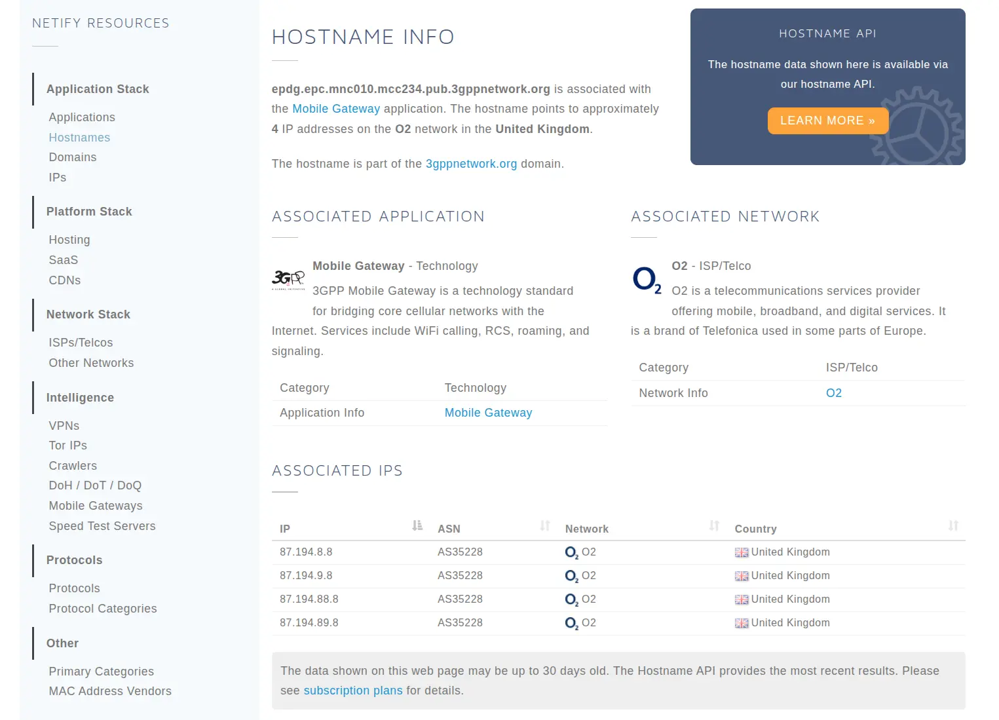

:::warning 注意
显示 `中国移动-giffgaff` 说明当前并没有成功启用 WLAN 通话。
:::

## 🧩 通用步骤

1. 在 **全局英国** 网络环境下，通过 giffgaff App 将 esim 添加到手机。这将直接影响到所下载的运营商配置文件，所以需要确保网络环境正确。
2. 关闭 **自动选择网络** 开关，然后手动选择网络，选信号几乎没有的、或禁止连接的。否则会走中国移动，而不是 WLAN 通话。
3. （可选）也可以直接在 giffgaff App 关闭漫游。就不用关闭自动选择网络了，即使中国移动满格，也会走 WLAN 通话。
4. 开启飞行模式，等一小会。
5. 确保网络环境是英国，即可关闭飞行模式，看到 WLAN 通话状态。

💡 权衡利弊：

- 步骤 2 可以在外出时，选择中国移动，正常使用短信、电话、上网功能，按漫游价格计费。在家里选择无信号的网络，回落到 WLAN 通话，按英国本地价格计费。
- 步骤 3 比较省事，只要网络环境处于英国，自动切换到 WLAN 通话。但无英国网络环境时，将无法使用短信、电话、上网功能。

到这里就结束了😊，打国内朋友的电话记得加 `86` 或者 `0086`。

{/* truncate */}

<div style={{display:'flex',gap:8}}>
  
  
</div>

<hr/>

## 🧠 自定义分流规则

不希望全局都走英国，只希望 WLAN 通话走英国流量。

### 🔍 抓包分析

在路由器抓包分析 WLAN 通话所要访问的域名或 IP，并根据端口号 `4500` 和 `500` 筛选特定流量，对其域名或 IP 进行分流即可。

通过 SSH 连接路由器，利用 `tcpdump` 抓包，手机对应的 IP 是 `192.168.100.239`，它连接的无线网络接口是 `phy1-ap0` ：

```bash
tcpdump -i phy1-ap0 -n -w /tmp/wificalling.pcap "host 192.168.100.239"
```

将 `/tmp/wificalling.pcap` 传到电脑上，利用 Wireshark 分析。

<hr/>

### 🔍 Wireshark 分析流量

筛选由 `192.168.100.239` 所发送的，且 UDP 端口号为 `500` 或 `4500` 的请求，规则如下：

```bash
(udp.port == 500 || udp.port == 4500) && (ip.src == 192.168.100.239)
```

筛选后，看到请求了 `epdg.epc.mnc010.mcc234.pub.3gppnetwork.org`，通过查询得知是英国 [O2](https://www.netify.ai/resources/hostnames/epdg.epc.mnc010.mcc234.pub.3gppnetwork.org) 运营商网络，并且还有相关的 IP 地址 👇。



<hr/>

### 🎯 添加分流规则

让 O2 网络的 IP 和这个 epdg 域名的连接，全都走 UK 策略组。

```yaml
# OpenClash
rules:
- IP-CIDR,87.194.0.0/19,UK
- IP-CIDR,87.194.88.0/23,UK
- DOMAIN-SUFFIX,epdg.epc.mnc010.mcc234.pub.3gppnetwork.org,UK
```

<hr/>

## 📌 总结

⚠️ 注意：

- 添加 ESIM 时的网络环境。
- 信号好会优先走漫游，所以别自动选择网络。手动选个没信号，或连不上的，即可回落到 WLAN 通话。
- 节点是否支持 UDP？当前代理模式是否转发 UDP？

模仿 ChatGPT 的方式，三句话不离 Emoji，写完看起来好像效果不错 😆。
